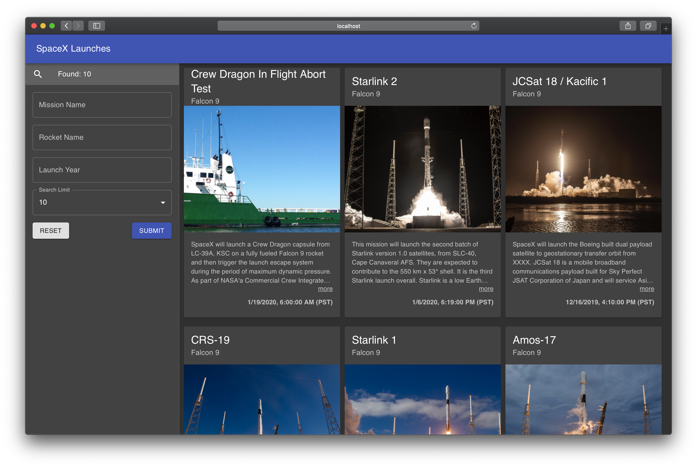

## SpaceX GraphQL Sample

Sample project to search SpaceX past launches by mission name, rocket name and launch year using the following technologies:

* SpaceX GraphQL Server
* Apollo GraphQL Client Library
* React (with Hooks)
* Material-UI
* Jest/Enzyme (for unit-testing)

Once yarn launches the application go to:

http://localhost:3000/

### To clone

    git clone https://github.com/nangchan/spacex.git

### To install

    cd spacex
    yarn install

### To run the app

    yarn start

### To run the tests

    yarn test
